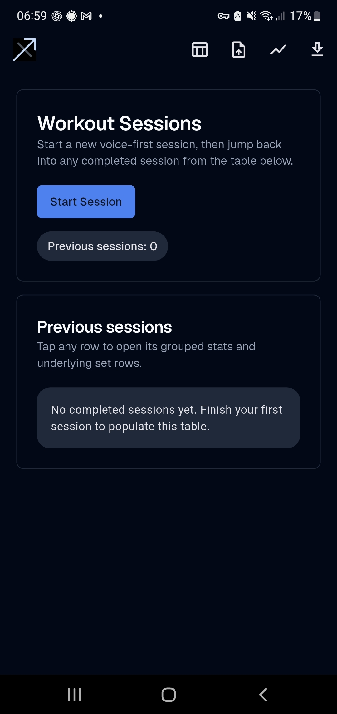
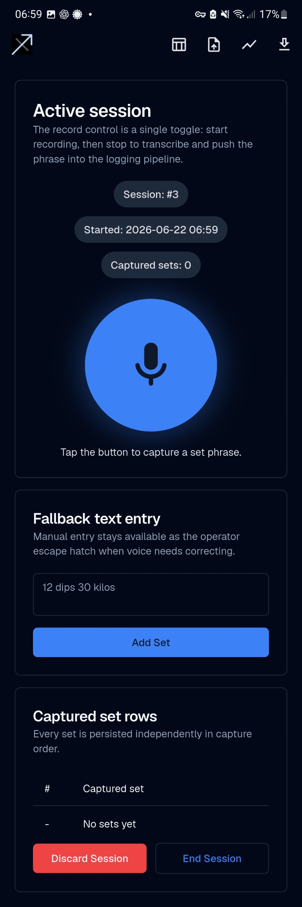
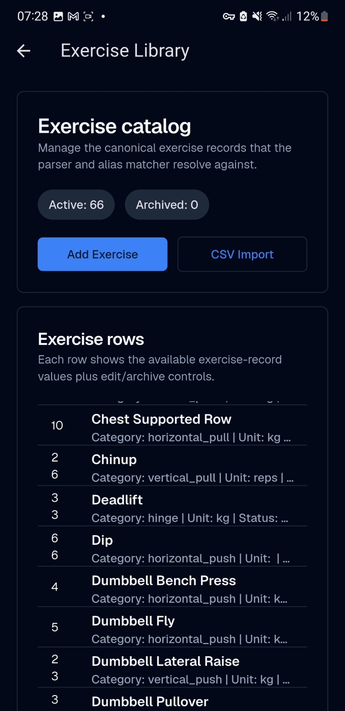
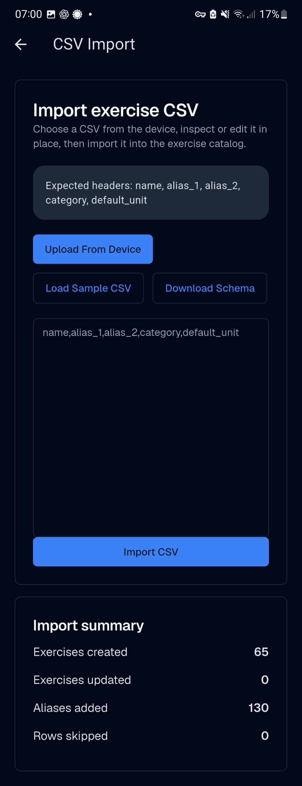
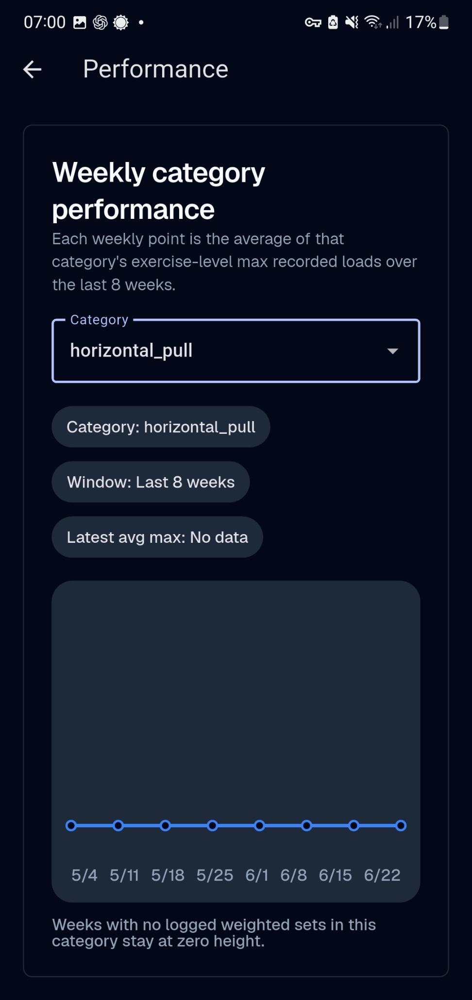

<p align="center">
  
</p>

# Chiron

Voice-first structured data capture for workout logging.

I built Chiron because it is annoying to fiddle with menus and enter numbers on a phone during a workout, and voice-entry technology is now good enough to make a practical alternative worth building.

This repo uses workout logging as the proving ground, but the underlying idea is broader: capture a small structured event quickly at the point of work, normalize it, persist it, and keep a human fallback when voice is imperfect.

## Repository Description

Voice-first structured data capture for workout logging, built as a practical Flutter prototype with local persistence, CSV interoperability, and on-device transcription.

## Demo

### Demo Video

[Watch the demo video](./docs/media/chiron-recording.mp4)

The video shows a session being started, a set being captured by voice, the parsed result appearing in the log, and the surrounding workflow in the app.

### Screenshots

<table>
  <tr>
    <td align="center">
      <strong>Session Management</strong><br />
      
    </td>
    <td align="center">
      <strong>Voice Set Capture</strong><br />
      
    </td>
  </tr>
  <tr>
    <td align="center">
      <strong>Exercise Library</strong><br />
      
    </td>
    <td align="center">
      <strong>CSV Import</strong><br />
      
    </td>
  </tr>
  <tr>
    <td align="center" colspan="2">
      <strong>Performance Charts</strong><br />
      
    </td>
  </tr>
</table>

## Why This Exists

During a workout, I might be moving between sets, short on breath, handling equipment, or simply unwilling to fight a phone UI for something as small as "12 dips, 30 kilos". I built Chiron to explore a more practical interaction model:

- capture short, structured events at the moment they happen
- prefer voice when it reduces friction
- keep a manual fallback when voice is inconvenient or wrong
- normalize the result into a clean local data model
- make the captured data useful later for review, export, and simple analysis

This project allowed me to explore:

- identifying a place where menus are the wrong interface
- constraining the input grammar instead of pretending the problem is open-ended conversation
- keeping a human fallback instead of forcing full automation
- normalizing raw input into a useful local data model

It helps me resolve something annoying in what I do every day, with:

- voice UX in constrained environments
- structured capture at the point of work
- local-first mobile product design
- human-in-the-loop system design

## Features

- Start, end, and discard workout sessions
- Capture weighted sets by voice
- Fall back to manual text entry on the same active-session screen
- Persist sessions, sets, exercises, and aliases locally
- Maintain an exercise library with canonical names, categories, default units, and aliases
- Import exercise data from CSV
- Export captured set data as CSV with one row per set
- Review previous sessions and drill into per-session detail
- View a basic weekly performance chart by exercise category

Current product rules:

- A set must resolve to a known canonical exercise or alias before it is saved
- The current capture flow requires reps, load, and unit
- Repeated sets are stored individually, then grouped in summaries
- Data is local-first; there is no account system or cloud sync

## How It Works

The core interaction loop is intentionally narrow.

1. Start a session.
2. Capture a set by voice or type a phrase manually.
3. Parse the phrase into structured fields.
4. Resolve the exercise phrase against the local catalog.
5. Save the set.
6. Review the session later as a grouped summary, a per-set log, a CSV export, or a simple chart.

An example phrase looks like:

`12 dips 30 kilos`

On the active session screen, the record control is a single toggle. Tap once to start recording. Tap again to stop and transcribe. The transcript is then fed into the same structured ingestion pipeline used by the manual text box.

This makes the voice path and the manual path share the same validation logic instead of drifting into two different systems.

## Architecture

Chiron is a Flutter app under [`app/`](./app) with a straightforward local-first structure:

- `app/lib/src/app`
  App bootstrap, routing, theming
- `app/lib/src/core`
  Drift-backed persistence and database wiring
- `app/lib/src/features/exercise_library`
  Exercise catalog CRUD, CSV import, and file access
- `app/lib/src/features/session`
  Session lifecycle, parsing, matching, export, summaries, and charts
- `app/lib/src/features/speech`
  Audio capture and transcription integration

Key implementation choices:

- Flutter for a fast mobile prototype with Android-first validation
- Drift and SQLite for local structured persistence
- `record` for audio capture
- `whisper_ggml_plus` for on-device transcription
- `file_picker` for CSV import/export on device
- `shadcn_ui` for the current UI shell

The current system is intentionally local-first. It does not depend on accounts, cloud APIs, or server-side inference to function.

## Data Model And Parsing Flow

The data model is small and explicit:

- sessions
- captured sets
- exercises
- exercise aliases

The parsing flow is deterministic.

1. Tokenize the input phrase.
2. Read the first token as reps.
3. Read the trailing tokens as load and unit.
4. Treat the middle span as the exercise phrase.
5. Normalize punctuation and spacing.
6. Resolve the phrase against canonical exercise names and aliases.
7. Save the normalized record if resolution succeeds.

The app currently supports unit aliases such as:

- `kg`, `kgs`, `kilo`, `kilos`
- `lb`, `lbs`, `pound`, `pounds`

It also tolerates small normalization differences such as punctuation and simple plural forms. For example, `pullup` and `pullups` can resolve to the same canonical exercise if that exercise exists in the catalog.

This is deliberately not a fuzzy free-for-all. The current implementation favors rejection over a bad automatic match.

## Roadmap

This repo is already usable, but it is still a prototype. The main open directions are practical rather than speculative:

- stronger public repo packaging and documentation
- more polished release and signing workflow
- better session-history browsing and deeper analytics
- improved charting and reporting
- continued refinement of the voice interaction model
- broader evaluation of voice-first structured capture outside workout logging

The important point is not "add more AI". It is improving reliability, speed, and trust at the point of entry.


## Setup And Run

This repository contains the Flutter app in [`app/`](./app).

Tested toolchain:

- Flutter `3.44.2`
- Dart `3.12.2`
- Java `17`

Android builds currently require NDK `29.0.13113456` because of the transcription dependency.

### Run Locally

```bash
cd app
flutter pub get
flutter test
flutter run
```

### Build Android APKs

```bash
cd app
flutter build apk --debug
flutter build apk --release
```

Notes:

- the GitHub Actions workflow builds both debug and release APKs
- the current release build is useful as a build artifact, but proper production signing is a separate concern
- on first transcription use, the Whisper model may need to be downloaded to device storage

## Summary

Chiron is a working example of voice-first structured data capture in a context where menus are a poor interface. I built it to remove friction from workout logging, but the more general interest is broader: a practical human-in-the-loop system that captures small structured events quickly, validates them, stores them locally, and keeps the workflow moving.
